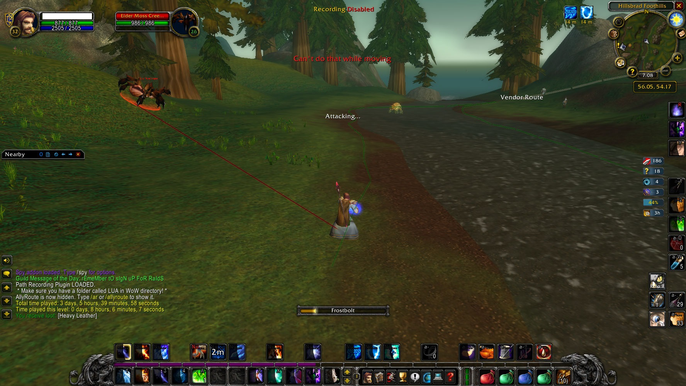

An old LUA script which I wrote and used during Classic launch to primarily level a Hunter & Mage (requires a unlocking of LUA Protected Functions). 

### NOT MEANT TO BE USED AS IS UNLESS YOU UNDERSTAND THE CODE AND ARE WILLING TO MAKE MASSIVE CHANGES TO SUITE YOUR NEEDS. 

Code can nevertheless be consulted although the code is admittedly quite messy (project was just a proof of concept to get a Hunter Alt up all the way from level 10-60 with this).

Current Configuration/Waypoints are for grinding in Felwood for Horde.

#### SUPPORTS (ON CONFIGURING GLOBAL VARS):
- Resurrect (configure resurrect.lua)
- Vendoring/Selling of Junk (vendors when running out of bag space)
- Repairing of Gear
- Mailing to Alt of valuable items (configure mail.lua) [‘toMail’]
- Drawing of All Routes, Enemies, Debugging Strings, Status etc… (configurable)
- Random Jumping, Emoting, Opening of Tabs (ex: guild or character tabs)
- Looting & Skinning
- Buying of Arrows, Food and Drinks
- Mage and Hunter Combat Rotations ONLY
- Hunter Pet Management
- Conjuring of Food/Water/Mana Gems
- Simple Mage/Hunter Kiting, CCing (Polymorph - if 1v2+, CS, Stuns...)
- DC on Item Break/Enemy Nearby
- Can randomize path ['rndMax']
- Auto-Junk/Pesky Item Deletion [‘deleteItems’]
- Automatic Opening of Items ex: Clams [‘openInBags’]
- Avoids Flagged NPCs/Elites (tries to even move out of aggro range) [‘avoidNPCs’]
- Fights only mobs off a similar level range (configurable)
- More but I forgot…

#### Things amongst many that need Configuring:
- Grinding Route Waypoint (make use of Record AddOn attached to record said routes)
- Resurrect Waypoints
- Vendor Waypoints
- Vendor Names
- Names of Food/Drink/Pet Food
- Mount Name
- Items you want to ALWAYS keep
- Eat at %, Drink at %, Recover till %
- Pull distance, Mana/HP Potion Use
- More but I forgot...

Really and truly, I cannot answer detailed questions about this project in much detail because it has been almost a year since I wrote this and was initially a small script which ended up into more than 4000 lines of spaghetti code.

Screenshot of a very early version which I managed to find:

